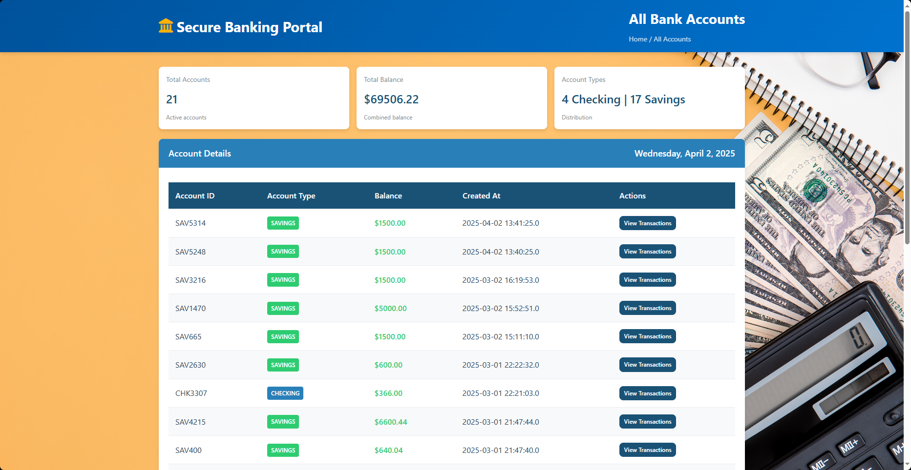
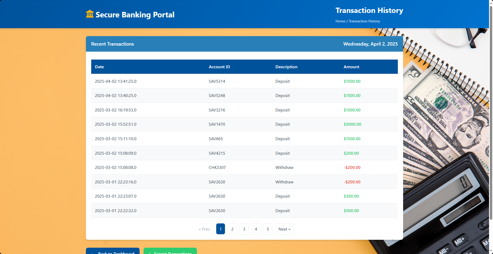
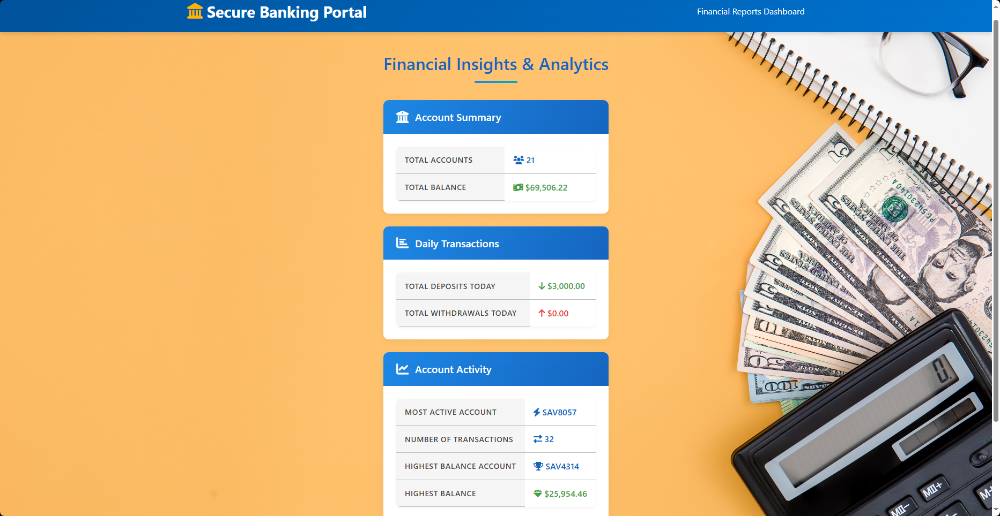

# 🏦**Banking System Web App using JSP and Servlet**  

#### 📖 Overview  
This is a **web-based banking system** built using **JSP, Servlets, and MySQL**. It allows users to create accounts, manage their funds, and perform transactions. The project follows a **Layered Architecture with MVC Principles** and uses **HikariCP for database connection pooling** to enhance performance.  

---

## 🚀 Features  
✅ **Account Management** – View balance, transaction history, and user details  
✅ **Fund Transfers** – Send money between accounts securely  
✅ **Transaction Logging** (Deposits, Withdrawals)  
✅ **Automatic Database Initialization** (Loads `create_database.sql` & `schema.sql`)  
✅ **Secure Database Connection with HikariCP**  
---

## 🛠️ Tech Stack  
| Technology      | Version  |
|----------------|----------|
| **Java**       | 17       |
| **JSP & Servlets** | Jakarta EE 6.1.0 |
| **MySQL**      | 9.2.0 (Connector) |
| **HikariCP**   | 5.1.0    |

---
## Project Structure
```pgsql
src/
│── main/
│   ├── java/
│   │   ├── db/          # Database connection (JDBC & HikariCP)
│   │   ├── exception/   # Custom exceptions
│   │   ├── model/       # Account & Transaction models
│   │   ├── service/     # Business logic
│   │   ├── util/        # Helper classes
│   │   ├── webservlet/  # Servlets (Controller Layer)
│   ├── resources/
│   │   ├── create_database.sql  # SQL script to create the database
│   │   ├── schema.sql           # SQL script to create tables
│   ├── webapp/                  # JSP & Static Resources
│── test/                        # Unit Tests
```

---

### 🏛 Architecture  

This project follows a **Layered Architecture with MVC Principles**, ensuring a clear separation of concerns:  

- **Model Layer (`model`, `db`)** – Defines entities and manages database interactions.  
- **Service Layer (`service`)** – Contains business logic and transaction processing.  
- **Controller Layer (`webservlet`)** – Handles HTTP requests and forwards data to views.  
- **View Layer (JSP Files)** – Renders the user interface using JSP and JSTL.  
- **Utility & Exception Handling (`util`, `exception`)** – Provides helper functions and error handling.  

> **Note:** While the project follows MVC principles, servlets handle both request processing and view forwarding. Future improvements may include migrating to **Spring MVC** or a frontend framework like **React**.  

---


## 🔧 Installation & Setup  

### 📌 Prerequisites  
Ensure you have:  
✔️ **JDK 17+** installed  
✔️ **Apache Tomcat 9/10+** installed  
✔️ **MySQL Server** running  

### **1. Clone the Repository** 🚀
```sh
git clone https://github.com/ZeroXZ01/Banking-System-Web-Based.git
cd Banking-System-Web-Based
```

### **2. Database Setup** 💻
The database and tables are **automatically created** when the application runs. The `DatabaseConnection.java` file **loads and executes** the following SQL scripts:

- **`create_database.sql`** → Creates the database if it does not exist.
- **`schema.sql`** → Creates the necessary tables.

However, if you prefer manual setup, follow the steps below.

#### **Option 1: Using MySQL CLI** 💡
```sh
mysql -u root -p < src/main/resources/create_database.sql
mysql -u root -p db_web_based_banking < src/main/resources/schema.sql
```

#### **Option 2: Using MySQL Workbench** 🛠️
1. Open **MySQL Workbench**.
2. Open and execute `src/main/resources/create_database.sql` to create the database.
3. Open and execute `src/main/resources/schema.sql` to create the necessary tables.

### **3. Configure Database Connection** 🔧
The project has a `DatabaseConnection.java` class that handles database connections. It:
- Uses **HikariCP** for connection pooling.
- Loads and executes `create_database.sql` and `schema.sql` automatically.
- Ensures the database schema is initialized at startup.

Alternatively, you can configure the database using an **`application.properties` file** (recommended for future migration to Spring Boot):  

```
spring.datasource.url=jdbc:mysql://localhost:3306/db_web_based_banking
spring.datasource.username=root
spring.datasource.password=
spring.datasource.driver-class-name=com.mysql.cj.jdbc.Driver
spring.datasource.hikari.maximum-pool-size=10
```

---
## **Running the Project**
### **Using Maven and Tomcat**
1. **Build the project**  
   ```sh
   mvn clean package
   ```
2. **Deploy it to Tomcat**:  
   - Copy `target/Week_3_Solution_Web_Based.war` to Tomcat's `webapps/` directory.  
   - Start Tomcat and access the app at:  
     ```
     http://localhost:8080
     ```
---

## 📌 Application Screenshots  
---
### Homepage


### Account List


### Deposit


### Withdraw


### Transaction List


### Financial Report



---

## 📌 Future Plans  
✔️ Migrate to **Spring Boot** for better scalability   
✔️ Build a **React-based frontend**  

---

## 👨‍💻 Contributors  
- **Rolando Cruz** – Developer  

---

## 📜 License  
This project is **open-source** under the MIT License.  

---

---

Let me know if there's anything else you need! 😊

