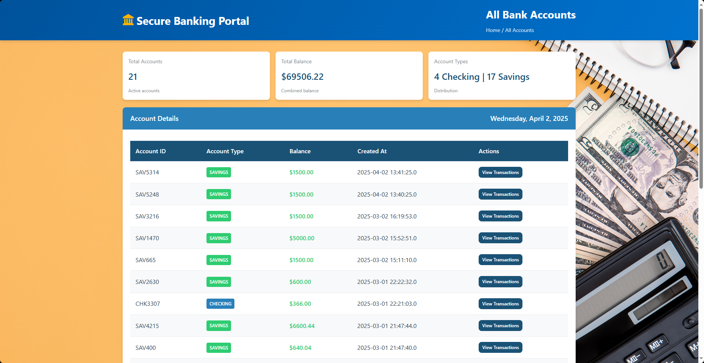
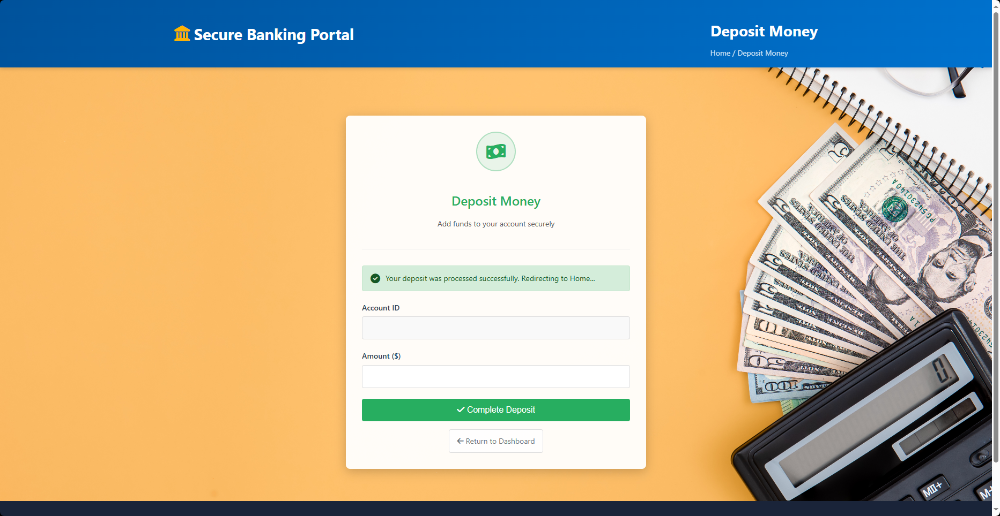
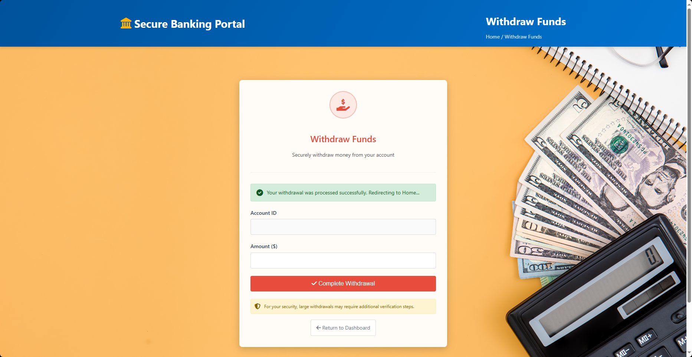
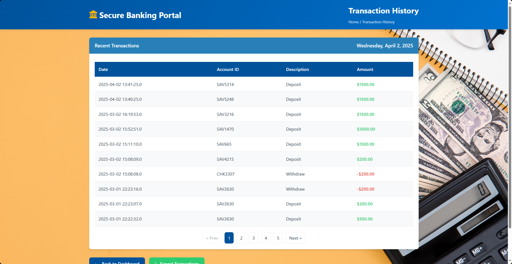
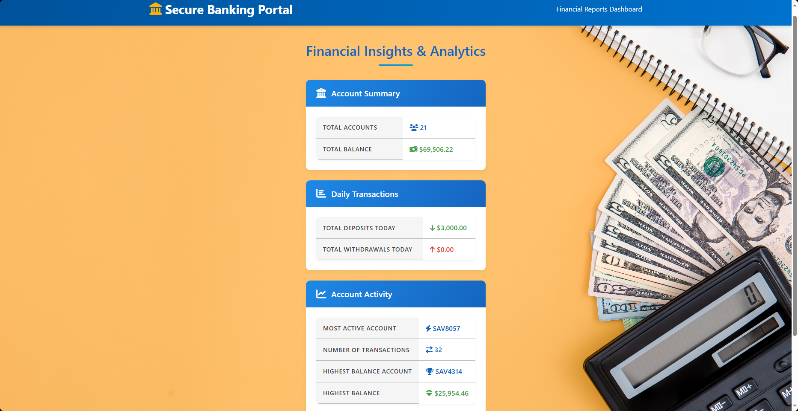

# 🏦**Banking System Web App using JSP and Servlet**  

#### 📖 Overview  
This is a **web-based banking system** built using **JSP, Servlets, and MySQL**. It allows users to create accounts, manage their funds, and perform transactions. The project follows a **Layered Architecture with MVC Principles** and uses **HikariCP for database connection pooling** to enhance performance.  

---

## 🚀 Features  
✅ **Account Management** – View balance, transaction history, and user details  
✅ **Fund Transfers** – Send money between accounts securely  
✅ **Transaction History** – Track deposits and withdrawals  
✅ **Database Integration** – MySQL with indexes for optimized queries  

---

## 🛠️ Tech Stack  
| Technology      | Version  |
|----------------|----------|
| **Java**       | 17       |
| **JSP & Servlets** | Jakarta EE 6.1.0 |
| **MySQL**      | 9.2.0 (Connector) |
| **HikariCP**   | 5.1.0    |

---

### 🏛 Architecture  

This project follows a **Layered Architecture with MVC Principles**, ensuring a clear separation of concerns:  

- **Model Layer (`model`, `db`)** – Defines entities and manages database interactions.  
- **Service Layer (`service`)** – Contains business logic and transaction processing.  
- **Controller Layer (`webservlet`)** – Handles HTTP requests and forwards data to views.  
- **View Layer (JSP Files)** – Renders the user interface using JSP and JSTL.  
- **Utility & Exception Handling (`util`, `exception`)** – Provides helper functions and error handling.  

> **Note:** While the project follows MVC principles, servlets handle both request processing and view forwarding. Future improvements may include migrating to **Spring MVC** or a frontend framework like **React**.  

---


## 🔧 Installation & Setup  

### 📌 Prerequisites  
Ensure you have:  
✔️ **JDK 17+** installed  
✔️ **Apache Tomcat 9/10+** installed  
✔️ **MySQL Server** running  

### 📥 Clone the Repository  
```sh
git clone https://github.com/ZeroXZ01/Banking-System-Web-Based
cd banking-system
```

### 📌 Configure MySQL Database  
1. **Create the database** in MySQL:  
   ```sql
   CREATE DATABASE db_web_based_banking;
   USE db_web_based_banking;
   ```
2. **Create required tables**:
   ```sql
   -- Create Accounts table
   CREATE TABLE IF NOT EXISTS accounts (
       account_id VARCHAR(10) PRIMARY KEY,
       account_type VARCHAR(20) NOT NULL,
       balance DECIMAL(10,2) NOT NULL,
       created_at TIMESTAMP DEFAULT CURRENT_TIMESTAMP
   );

   -- Create Transactions table
   CREATE TABLE IF NOT EXISTS transactions (
       transaction_id BIGINT AUTO_INCREMENT PRIMARY KEY,
       account_id VARCHAR(10) NOT NULL,
       amount DECIMAL(10,2) NOT NULL,
       description VARCHAR(255),
       transaction_date TIMESTAMP DEFAULT CURRENT_TIMESTAMP,
       FOREIGN KEY (account_id) REFERENCES accounts(account_id)
   );

   -- Create indexes for better performance
   CREATE INDEX IF NOT EXISTS idx_account_id ON transactions(account_id);
   CREATE INDEX IF NOT EXISTS idx_transaction_date ON transactions(transaction_date);
   ```
### ⚙️ Database Configuration  

This project **already includes a Java-based JDBC connection** in `DatabaseConnection.java`, which handles:  
✅ Connecting to MySQL  
✅ Creating the database if it does not exist  
✅ Initializing the schema from `schema.sql`  

Alternatively, you can configure the database using an **`application.properties` file** (recommended for future migration to Spring Boot):  

```
spring.datasource.url=jdbc:mysql://localhost:3306/db_web_based_banking
spring.datasource.username=root
spring.datasource.password=yourpassword
spring.datasource.driver-class-name=com.mysql.cj.jdbc.Driver
spring.datasource.hikari.maximum-pool-size=10
```


### 🚀 Build & Deploy  
1. **Build the WAR file** using Maven:  
   ```sh
   mvn clean package
   ```
2. **Deploy it to Tomcat**:  
   - Copy `target/Week_3_Solution_Web_Based.war` to Tomcat's `webapps/` directory.  
   - Start Tomcat and access the app at:  
     ```
     http://localhost:8080
     ```

---

## 📌 Application Screenshots  
---
### Homepage


### Account List


### Deposit


### Withdraw


### Transaction List


### Financial Report



---

## 📌 Future Plans  
✔️ Migrate to **Spring Boot** for better scalability   
✔️ Build a **React-based frontend**  

---

## 👨‍💻 Contributors  
- **Rolando Cruz** – Developer  

---

## 📜 License  
This project is **open-source** under the MIT License.  

---

